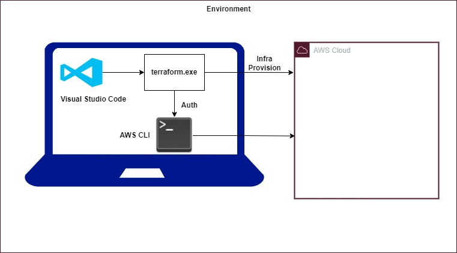

### TERRAFROM

Below is the environment setup.

**Softwares:**

* VS Code
* Terraform
* AWS CLI V2

**Steps:**

* Create IAM administrator user. Copy the access key and secret key. Don't push to any Github or internet.
* Configure user using
```
aws configure
```
* Add the terraform path to system variables.





Terraform is popular IaC (Infrastructure as a Code) tool. It is best in the market now.

* **Version Control:** <br />

Since it is code, we can maintain in Git to version control. We can completely maintain the history of infra and collaboration is easy.

* **Consistent Infra:** <br />

Often we face the problem of different configurations in different environments like DEV, QA, PROD, etc. Using terraform we can create similar infra in multiple environments with more reliability.

* **Automated Infra CRUD:** <br />

Using terraform we can create entire infra in minutes reducing the human errors.
Updating infra using terraform is also easy.
Using Terraform we can delete infra.

* **Inventory Management:** <br />

If we create infra manually it is very tough to maintain the inventory of resources in diff region. But by seeing terraform you can easily tell the resources you are using in different regions.

* **Cost Optimisation:** <br />

When you need infra you can create in minutes. When you don't you can delete in minutes, so you can save the cost.

* **Automatic dependency management:** <br />

terraform can understand the dependency of resources. It can tell us the dependency clearly.

* **Modular Infra:** <br />
Code reuse. We can develop our own modules our use open source modules to reuse the infra code. instead of spending more time to create infra from the scratch we can reuse modules.