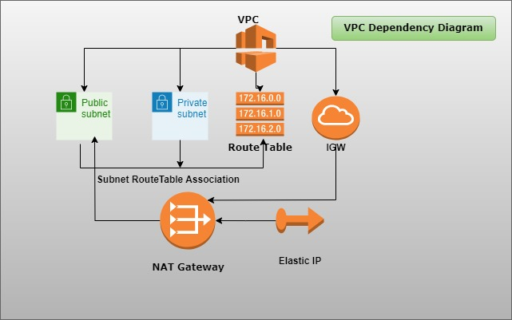

### Session-02

**This session is about creating VPC through Terraform. One should have basic knowledge of VPC.**

Below is the dependency diagram for better understanding.
* First we create VPC.
* Create Subnets. Public and Private into the above VPC.
* Create Internet Gateway.
* Attach Internet Gateway to VPC.
* Create Route Tables. Usually public and private. Route table will have automatic route of VPC.
* Associate route tables with subnets.
* Create EIP. Here elastic IP is independent resource.
* Create NAT gateway. NAT gateway has explicit dependency on Internet Gateway.

